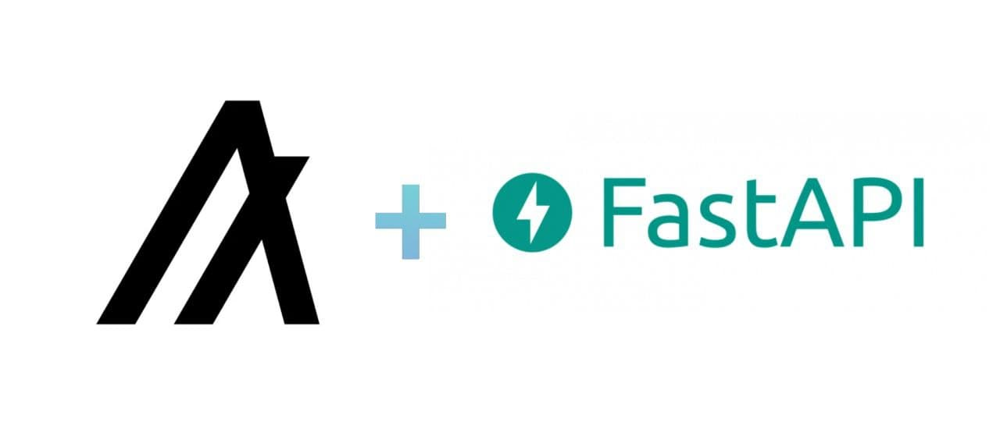

This repository is part of the [article](https://developer.algorand.org/solutions/python-algorand-sdk-and-fastapi/)
# Getting started with Python Algorand SDK and FastAPI
This FastAPI application implements some Algorand blockchain processes using `py-algorand-sdk`.

---
**Security warning**

This project has not been tested and should never be used in production

---

# Requirements

You must have python 3 installed on your system. Also for this tutorial you will need `python3-venv`. This package can be installed with the following command. 
```bash
$ sudo apt-get install python3-venv
```
This manual assumes that [Algorand Sandbox](https://github.com/algorand/sandbox) is already installed on your system.

# Setup
First create a root folder for the project
```bash
cd ~
mkdir algorand-fastAPI
cd algorand-fastAPI
```
Then clone this repository into it
```bash
git clonne https://github.com/Slava096/Algorand-fastAPI.git
cd Algorand-fastAPI
```
Then create and activate a new virtual environment
```bash
python3 -m venv Algorand-fastAPI
./Algorand-fastAPI/bin/activate
```
Then install all dependencies with the following command
```bash
(Algorand-fastAPI) $ pip3 install -r requirements.txt
```
Now you can run the application with this command
```bash
(Algorand-fastAPI) $ uvicorn main:app --reload
```
As soon as the application starts, you will have access to the online documentation at http://127.0.0.1:8000/docs#/
